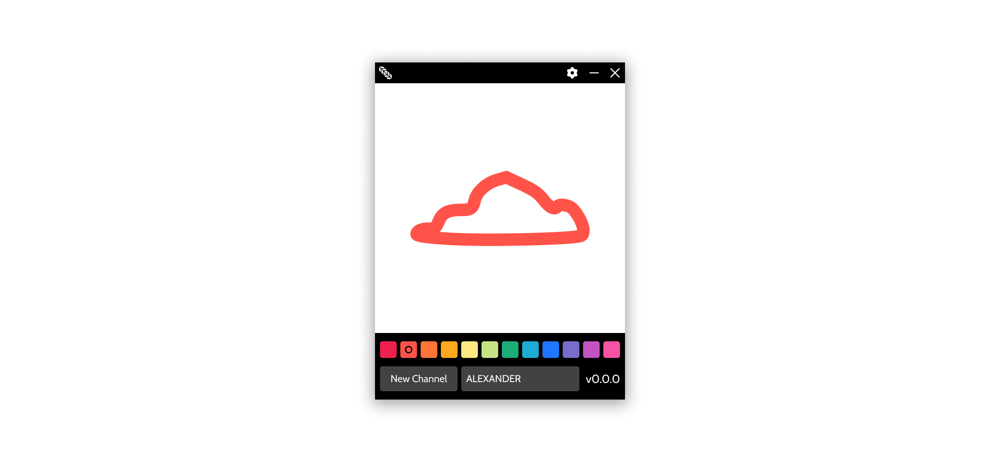
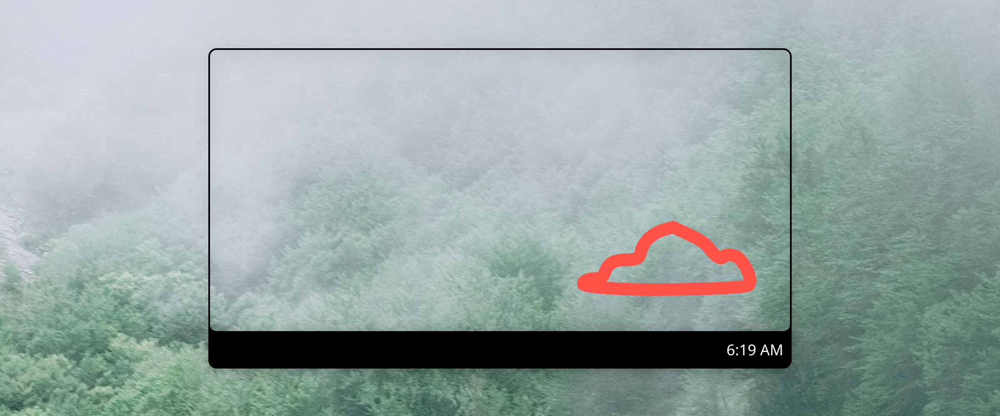

<div>
    <h2 align="center">Quill</h2>
    <p align="center">Doodle together with Quill</p>
</div>



---

## Download

**[Latest Release](https://github.com/quilllol/quill-app/releases/latest)**


---

## Quill Sketchpad

Your place to doodle. Transferred instantaneously to your channel’s sketchpads and desktops.

---

## Quill Desktop

Quill Desktop is a completely transparent canvas for your friends to say hi.



---

## Quill Channels

Quill Channels lets you doodle with friends. Whether it’s a masterpiece or just a quick hey <3, every stroke will sync to your channel's sketchpads and desktops.

---

## Contributing

### Getting Started

1. Clone [quilllol/quill-app](https://github.com/quilllol/quill-app):

```shell
> git clone https://github.com/quilllol/quill-app.git
> cd quill-app
```

2. Install dependencies:

```shell
> npm install
```

3. Serve quill-app for development:

```shell
> npm run electron:serve
```

### Bug Reports

If you've identified a bug in [quilllol/quill-app](https://github.com/quilllol/quill-app), please [submit a bug report](https://github.com/quilllol/quill-app/issues/new) if one doesn't already exist.
In **addition** to submitting a bug report, feel free to [submit a pull request](#pull-requests) with a proposed fix.

### Feature Requests

If you have an idea for a new feature, please [submit a feature request](https://github.com/quilllol/quill-app/issues/new).
In **addition** to submitting a feature request, feel free to [submit a pull request](#pull-requests) with a proposed implementation.

### <a name="pull-requests"></a> Pull Requests

All pull requests should target the [main branch](https://github.com/quilllol/quill-app/tree/main). Please link to the issue in the description of the pull request using [special keywords](https://docs.github.com/en/github/managing-your-work-on-github/linking-a-pull-request-to-an-issue).

### License

By contributing your code, you agree to license your contribution under the [MIT License](LICENSE).

All files are released under the [MIT License](LICENSE).

---

## License

[MIT](LICENSE)
